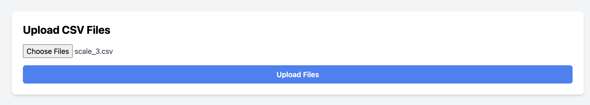

# Canix Product Importer

## Overview

The **Canix Product Importer** is a web application built with **Ruby on Rails** for the backend and **React** with **Tailwind CSS** for the frontend. It allows users to upload multiple CSV files containing product data from scales with built-in RFID scanners. The application processes the CSV files, stores the data in a PostgreSQL database, and displays:

- A list of all products grouped by category.
- The total weight of products in each category in kilograms.
- The date when the weighing process started for the import.

---

## Table of Contents

- [Features](#features)
- [Prerequisites](#prerequisites)
- [Setup Instructions](#setup-instructions)
    - [Backend Setup (Ruby on Rails)](#backend-setup-ruby-on-rails)
    - [Frontend Setup (React)](#frontend-setup-react)
- [Running the Application](#running-the-application)
    - [Starting the Backend Server](#starting-the-backend-server)
    - [Starting the Frontend Server](#starting-the-frontend-server)
- [API Endpoints](#api-endpoints)
- [Application Ports](#application-ports)
- [Assumptions and Design Decisions](#assumptions-and-design-decisions)
- [Screenshots](#screenshots)

---

## Features

- **File Upload:** Users can upload multiple CSV files containing product data.
- **Data Processing:** The backend processes the CSV files, extracts product information, and stores it in a PostgreSQL database.
- **Category Grouping:** Products are grouped by category, determined by the first three characters of the product ID.
- **Weight Summation:** Calculates the total weight of products in each category.
- **Start Date Display:** Shows the earliest date when the weighing process started for the imported data.
- **Responsive UI:** A clean and responsive user interface built with React and Tailwind CSS.

---

## Prerequisites

- **MacOS** or any Unix-based operating system (if using Docker, any platform is acceptable).
- **Ruby** (version 2.7.0 or newer).
- **Rails** (version 6.1 or newer).
- **Node.js** (version 14 or newer).
- **npm** (version 6 or newer).
- **PostgreSQL** (version 12 or newer).
- **Yarn** (optional, for managing frontend dependencies).

---

## Setup Instructions

### Backend Setup (Ruby on Rails)

#### 1. Install Dependencies

Ensure you have Bundler installed:

```bash
gem install bundler
```

Install the required gems:

```bash
bundle install
```

#### 2. Configure the Database

Create and configure the PostgreSQL database:

- Edit `config/database.yml` if necessary to update the database credentials.
- Create the database:

    ```bash
    rails db:create
    ```

#### 3. Run Migrations

```bash
rails db:migrate
```

#### 4. Seed the Database (Optional)

If you have seed data:

```bash
rails db:seed
```

---

### Frontend Setup (React)

#### 1. Navigate to the Frontend Directory

```bash
cd client/canix_app
```

#### 2. Install Dependencies

```bash
npm install
```

or if you're using Yarn:

```bash
yarn install
```

---

## Running the Application

### Starting the Backend Server

Start the Rails server on port **4000**:

```bash
rails server -p 4000
```

The backend server will be accessible at `http://localhost:4000`.

### Starting the Frontend Server

In a new terminal window, navigate to the frontend directory and start the React development server:

```bash
cd client/canix_app
npm start
```

The frontend server will run on port **3000** and can be accessed at `http://localhost:3000`.

---

## API Endpoints

The backend API provides the following endpoints:

- **GET /products**

    - **Description:** Retrieves all products, grouped by category, along with total weights and start date.
    - **Response:**

        ```json
        {
            "products_by_category": {
                "CAT": [
                    {
                        "id": 1,
                        "product_id": "CAT-123",
                        "date": "2024-11-01T01:30:32.977Z",
                        "weight": "0.160",
                        "unit": "kilograms",
                        "category": "CAT"
                    },
                    ...
                ],
                ...
            },
            "total_weights": {
                "CAT": "10.500",
                ...
            },
            "start_date": "2021-03-01T01:30:32.977Z"
        }
        ```

- **POST /products/import**

    - **Description:** Uploads CSV files for processing and data import.
    - **Request Parameters:**
        - **files[]**: One or more CSV files.
    - **Response:**

        ```json
        {
            "message": "Files are being processed"
        }
        ```

---

## Application Ports

- **Backend (Rails API):** `http://localhost:4000`
- **Frontend (React App):** `http://localhost:3000`

---

## Assumptions and Design Decisions

- **Product Category Extraction:** The category of a product is determined by the first three characters of the `product_id`.
- **Weight Units:** All weights are provided in kilograms in the CSV files.
- **CSV File Structure:** The application assumes that the CSV files have a consistent structure as provided.
- **CORS Configuration:** The backend is configured to accept requests from any origin for development purposes.
- **Asynchronous Processing:** CSV files are processed asynchronously using Active Job to prevent blocking the server.
- **Data Storage:** All product data is stored persistently in a PostgreSQL database.

---

## Screenshots

_Add screenshots of the application interface here._

- **Home Page**
    

- **File Upload**
    

- **Product List by Category**
    

- **Total Weight by Category**
    

---

## Additional Notes

- **Tailwind CSS Integration:** The frontend uses Tailwind CSS for styling, offering a responsive and modern user interface.
- **Error Handling:** The application provides user-friendly error messages and handles exceptions gracefully.
- **Code Quality:** The codebase follows best practices for structure and readability, making it maintainable and scalable.
- **Environment Variables:** Ensure that environment variables (e.g., database credentials) are set appropriately.

---

## Conclusion

The Canix Product Importer provides an efficient way to import and view product data from CSV files generated by RFID-enabled scales. By following the setup instructions, you can run the application locally and explore its features.
---
